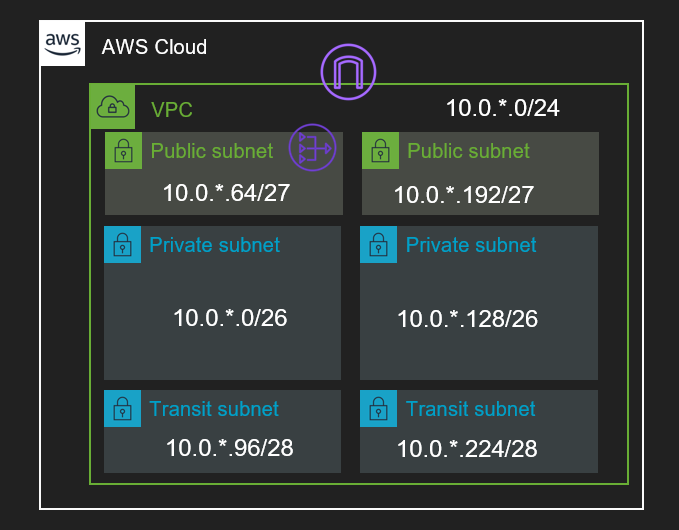

# awscli-workshop-basic-vpc

## About

AWS CLI(Command Line Interface)で基本的なVPCを構築するハンズオン資料。

## Project Goal

本ワークショップでは以下の構成のVPCを作成する。

## 手順シナリオ

1. [VCPを作成する](./0101-0100-CreateVPC-Scenario.md)
1. [Subnetを作成する](./0200-CreateSubnet-Scenario.md)
1. [Internet Gatewayを作成する](./0300-CreateIGW-Scenario.md)
1. [NAT Gatewayを作成する](./0400-CreateNGW-Scenario.md)
1. [Route Tableを作成する](./0500-CreateRouteTable-Scenario.md)
